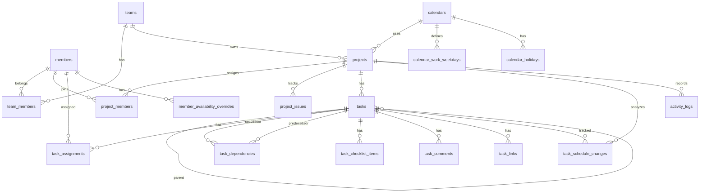

# Database Design

SI向けプロジェクト管理 / ガント管理アプリのDB設計メモです。
まずは SQLite + C# API で扱いやすい形を前提にしつつ、将来 PostgreSQL などへ移しやすい命名に寄せます。

## 方針

- データ構造は `team > project > task` を基本にする。
- プロジェクトはチーム未所属を許可する。`projects.team_id` は `NULL` を許容し、`未所属` は表示ラベルとして扱う。
- ガントはプロジェクトに属するタスク階層として表現する。
- 課題はプロジェクトに属し、将来GitHub Issuesと同期できる項目を先に保持する。
- 要員はチーム所属、プロジェクト参画、タスク担当を分けて管理する。
- マイルストーンはまず `tasks.type = milestone` として扱う。
- 画面の履歴表示用ログと、PM分析用のスケジュール変更履歴は分ける。
- 日付は `YYYY-MM-DD`、日時は UTC の ISO-8601 文字列を `text` で保存する。
- boolean は SQLite では `integer` の `0 / 1` として扱う。
- enum は `text` とし、アプリ層または migration の `CHECK` 制約で検証する。

## Directory

```text
docs/databases/
  README.md       -- 全体方針とER図
  tables.md       -- テーブル定義
  enums.md        -- 固定値 / enum定義
  indexes.md      -- Index / constraint方針
  change-log.md   -- 設計変更メモ
```

## ER Diagram



## MVP Tables

- `teams`
- `members`
- `team_members`
- `calendars`
- `calendar_work_weekdays`
- `calendar_holidays`
- `member_availability_overrides`
- `projects`
- `project_members`
- `project_issues`
- `tasks`
- `task_assignments`
- `task_dependencies`
- `task_checklist_items`
- `task_comments`
- `task_links`
- `task_schedule_changes`
- `activity_logs`

## Notes

- `activity_logs` は画面に出す操作履歴向け。
- `project_issues` はアプリ内課題管理向け。GitHub同期は後工程とし、まず紐付け用の項目だけ保持する。
- `task_schedule_changes` はPM分析向け。タスクごとの日程変更回数、フェーズ別の変更集中、見積もり精度の分析に使う。
- Brabio / CSV 取り込みは `task_schedule_changes.source` と `activity_logs.metadata_json` で由来を残す。
- ログイン情報はメンバーに紐づく資格情報として扱い、画面/API上は `members` に統合して扱う。
